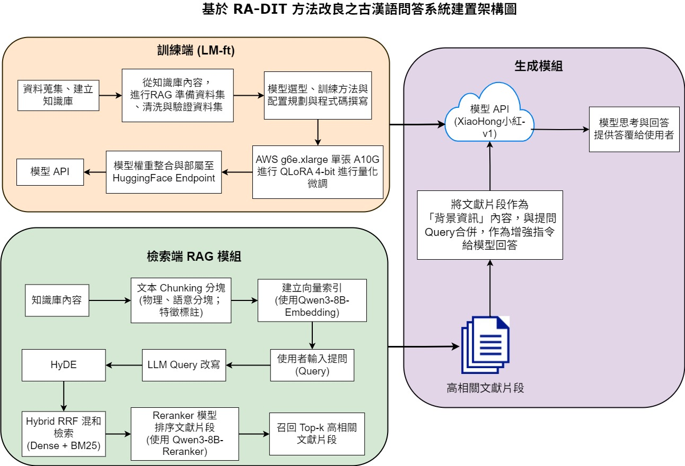
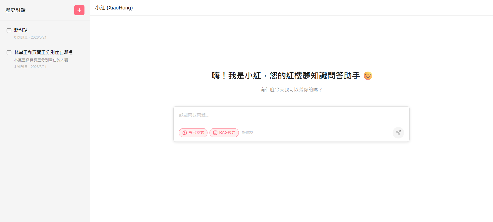
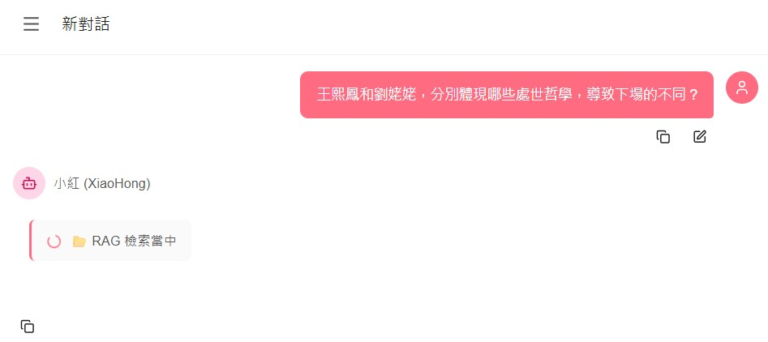
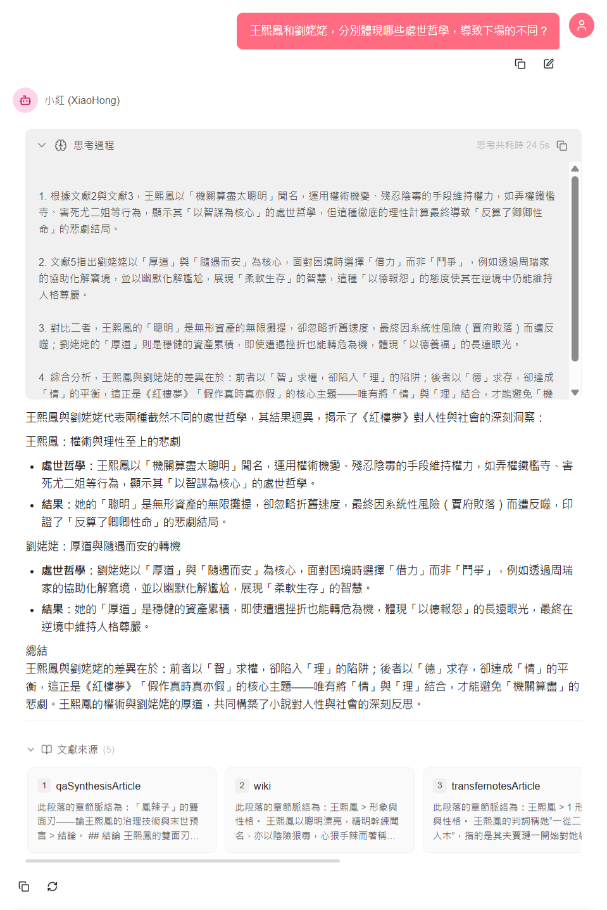
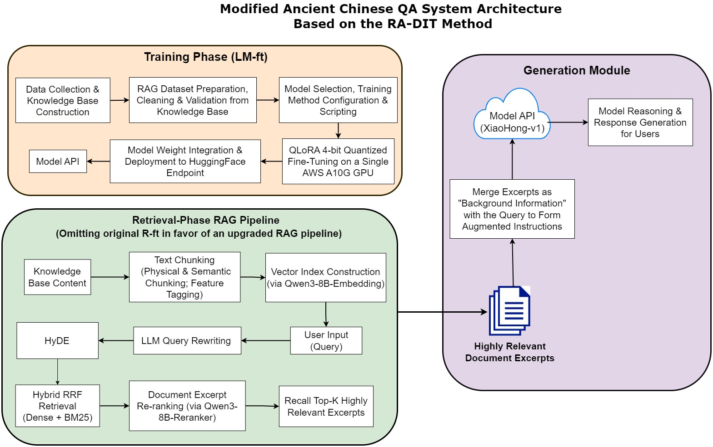

# 🌸XiaoHong Ancient Chinese QA System (小紅古典文學問答系統)

[English Version](#english-version) | [繁體中文版本](#繁體中文版本)

---

## 繁體中文版本

### 系統簡介
**XiaoHong Ancient Chinese QA System (小紅古典文學問答系統)** 是一個基於檢索增強雙重指令微調 (Retrieval-Augmented Double Instruction Tuning, RADIT) 架構 [(Lin et al., 2023)](https://arxiv.org/abs/2310.01352)，並以《紅樓夢》為場域，所建構的古典文學與國學常識問答系統。本專案為 NSTC (國科會) 學術研究計畫的一部分。
本系統分為兩個主要微服務：
- **Frontend (前端)**：以 Next.js 建構的現代化聊天介面，支援串流 (Streaming) 顯示與文獻溯源卡片。
- **Backend (後端)**：以 FastAPI 構建的後端微服務，負責處理 RAG 融合檢索 (FAISS + BM25) 以及大語言模型 (LLM) 推理。

具體系統建構方法如下圖所示：



🧠 訓練端（LM-ft）：基於 Qwen3-8B 模型，於單張 AWS A10G GPU 環境導入 QLoRA 4-bit 高效微調。系統將古籍轉化為「問題－背景－答案」標準配對，主動過濾口語化樣本，並混入 20% 負樣本訓練「無證據即拒答」機制；同時植入思維鏈（CoT）提示以強化跨章節推理能力。微調完成後封裝為 XiaoHong-v1 API 部署於 Hugging Face，供生成模組即時呼叫。

🔍 檢索端（RAG）：旨在跨越白話提問與文言知識庫之語體落差。離線階段將《紅樓夢》全文與國學典籍進行語意分塊（Semantic Chunking）並附加場景/人物標籤，轉換為 3584 維向量索引。線上檢索時，結合查詢改寫與假設性文檔嵌入（HyDE）預推古文關鍵字，同步執行密集檢索（語意）與稀疏檢索（BM25），經 RRF 演算法加權合併後，由重排序模型（Reranker）精篩 Top-K 高關聯文獻。

📝 生成模組與防護機制：檢索所得文獻強制拼接為增強提示詞（Augmented Prompt）輸入模型。XiaoHong-v1 優先評估文獻支撐度：若證據不足則觸發拒答機制，有效阻斷幻覺；若證據充分，則基於文獻進行邏輯推演與對比整合，輸出結構嚴謹、具學術價值之解析。此閉環架構確保所有回覆皆可溯源，大幅提升系統於國文教學與數位人文應用之可靠性。

### 模型微調與復現細節
詳細的訓練資料格式（如：問題-背景-答案 三元組與 CoT 思維鏈範例）、微調超參數設定，以及「防幻覺拒答」等機制的對話實例表，請參閱：👉 **[模型訓練與復現細節 (Model Training Details)](docs/MODEL_TRAINING_DETAILS.md)**

### 目錄結構
```
XiaoHong_RedChamber_QA_System/
├── frontend/             # Next.js 前端網頁介面
├── backend/              # FastAPI 後端 RAG 服務
├── src/main/python/      # 核心 RAG 與檢索服務套件
├── (預留) data/rag/      # 知識庫索引檔案放置處 (FAISS / BM25)
└── .env.example          # 全局環境變數範例檔
```

### 介面使用展示

1. 初始主頁面

介面採用聊天機器人的形式，精簡粉紅的風格，符合紅樓夢的色調設計。使用者可以選擇是否開啟思考模式，或RAG模式，或兩者都開啟。



2. 進行RAG檢索

若開啟RAG服務，即進行檢索，並將檢索到的文獻作為上下文提供給大語言模型。



3. 完整答覆

若開啟思考模式，則會根據檢索到的資料，進行條列式的思考分析，最後給出正式詳細的富有專業性的答覆。




### 逐步運行指南 (Step-by-Step Setup Guide)

#### 1. 前置作業一：設定環境變數 (Environment Variables)
本專案使用統一的環境變數設定。
1. 在專案**根目錄**下，找到 `.env.example` 檔案。
2. 複製該檔案，並將其副檔名 `.example` 移除掉，重新命名為 `.env`。
3. 打開 `.env` 並依序填入您專屬的 API 金鑰與主機網址（例如：`HF_ENDPOINT_URL`, `HF_TOKEN`, `OPENROUTER_API_KEY`, `NEXT_PUBLIC_API_URL` 等）。前後端啟動時都會自動讀取這個配置。

#### 2. 前置作業二：匯入知識庫資料庫檔案 (Importing Knowledge Base)
為避免版權或檔案過大問題，本專案不自帶資料庫檔案。請在啟動前，從您的備份或生產環境中提取以下 RAG 的知識庫索引檔案，並手動匯入對應目錄：
- **匯入 FAISS Index**: 請將建立好的 `chunks.index` 及對應的 `index_metadata.json` 直接放入 `data/rag/faiss_index/` 資料夾內。
- **匯入 BM25 Index**: 請將 `bm25_index.pkl` 與 `bm25_metadata.json` 直接放入 `data/rag/bm25_index/` 資料夾內。
> **注意**: 如果尚未放入這些知識庫資料庫檔案，後端依然可以啟動，但會觸發 Warning 並僅保留「無 RAG」的傳統大模型純聊天模式。

#### 3. 後端啟動 (Backend)
請確保您已安裝 Python 3.9+。
```bash
cd backend
# 建議使用虛擬環境
# python -m venv .venv
# source .venv/bin/activate (或 .venv\Scripts\activate)

# 安裝依賴
pip install -r requirements.txt

# 啟動伺服器 (預設在 8000 port)
# 當終端機出現 `INFO:Application startup complete.` 時，表示後端已順利啟動。
python -m uvicorn main:app --host 0.0.0.0 --port 8000 --reload
```

#### 4. 前端啟動 (Frontend)
請確保您已安裝 Node.js (建議 v18+)。
```bash
cd frontend

# 安裝依賴
npm install

# 啟動開發伺服器
npm run dev
```
啟動完成後，請打開瀏覽器造訪 [http://localhost:3000](http://localhost:3000)。

---

## English Version

### System Introduction

**XiaoHong Ancient Chinese QA System** is a platform for answering questions about Classical Chinese Literature and sinology, powered by a Retrieval-Augmented Dual Instruction Tuning (RA-DIT) architecture [(Lin et al., 2023)](https://arxiv.org/abs/2310.01352). This project is a constituent of an NSTC academic research proposal.
The system is cleanly decoupled into two microservices:
- **Frontend**: A modernized Next.js chat interface that supports streaming responses and citation tracking.
- **Backend**: A FastAPI microservice responsible for hybrid retrieval (FAISS + BM25) and Large Language Model (LLM) inference.

The specific system architecture is shown in the following figure:



🧠 LM-ft (Training): Fine-tune Qwen3-8B via QLoRA 4-bit on single A10G GPU. Train on "Question-Background-Answer" pairs with 20% negative samples for refusal capability, plus CoT prompts for cross-chapter reasoning. Deployed as XiaoHong-v1 API on Hugging Face.

🔍 RAG (Retrieval): Bridge vernacular-classical gap via semantic chunking + metadata tagging of Dream of the Red Chamber. Online: HyDE + query augmentation, hybrid dense/sparse retrieval (RRF fusion), reranked for top-K high-relevance documents.

📝 Generation: Retrieved docs form Augmented Prompt. XiaoHong-v1 checks evidence sufficiency: refuse if weak, reason & synthesize if strong. Closed-loop design ensures traceability, enhancing reliability for Chinese education and digital humanities.

### Model Training & Reproducibility
For detailed information on our model fine-tuning process—including data formats (QA triplets and CoT examples), fine-tuning hyperparameters, and conversational examples of hullucination prevention—please refer to our specific guide: 👉 **[Model Training & Reproducibility Details](docs/MODEL_TRAINING_DETAILS.md)**

### Directory Structure
```
XiaoHong_RedChamber_QA_System/
├── frontend/             # Next.js Web Interface
├── backend/              # FastAPI RAG Service 
├── src/main/python/      # Core retrieval and RAG service modules
├── (Empty) data/rag/     # Target directory for retrieval indices (FAISS/BM25)
└── .env.example          # Global environment variables template
```

### UI Demo

1. **Initial Main Page**

The interface adopts the form of a chatbot, with a simple and elegant pink style that matches the color tone of the Dream of the Red Chamber. Users can choose whether to enable thinking mode, RAG mode, or both.


2. **RAG Retrieval**

If RAG service is enabled, it will retrieve relevant documents and provide them as context to the large language model.


3. **Complete Answer**

If thinking mode is enabled, it will analyze the retrieved data in a step-by-step manner and finally provide a formal, detailed, and professional answer.


### Step-by-Step Setup Guide

#### 1. Prerequisite I: Configure Environment Variables
Both frontend and backend rely on a unified environment file.
1. Locate the `.env.example` file in the **root directory**.
2. Copy this file and remove the `.example` extension to rename it to `.env`.
3. Open the `.env` file and sequentially fill in your specific credentials and configurations (e.g., `HF_ENDPOINT_URL`, `HF_TOKEN`, `OPENROUTER_API_KEY`, `NEXT_PUBLIC_API_URL`).

#### 2. Prerequisite II: Import Knowledge Base Databases
To respect file size limits and data privacy, large databases are not tracked. Before starting the backend, export your indices from your backup environments and import them into the reserved directories:
- **Import FAISS Index**: Place your `chunks_qwen*.index` (or `chunks.index`) and `index_metadata_qwen*.json` directly into `data/rag/faiss_index/`.
- **Import BM25 Index**: Place your `bm25_index.pkl` directly inside `data/rag/bm25_index/`.
> **Note**: If you don't import these databases before launching, the backend will still gracefully start (yielding a Warning) and fall back to a standard LLM chat mode without RAG retrieval.

#### 3. Starting the Backend
Requires Python 3.9+.
```bash
cd backend
# Recommended to use a Virtual Environment
# python -m venv .venv
# source .venv/bin/activate (or .venv\Scripts\activate on Windows)

# Install Dependencies
pip install -r requirements.txt

# Run the Server (Defaults to port 8000)
# When the terminal shows `INFO:Application startup complete.`, it means the backend has started successfully.
python -m uvicorn main:app --host 0.0.0.0 --port 8000 --reload
```

#### 4. Starting the Frontend
Requires Node.js (v18+ recommended).
```bash
cd frontend

# Install Dependencies
npm install

# Start the Dev Server
npm run dev
```
Finally, open your browser and navigate to [http://localhost:3000](http://localhost:3000).
